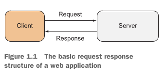
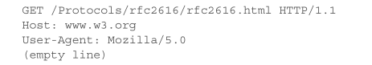
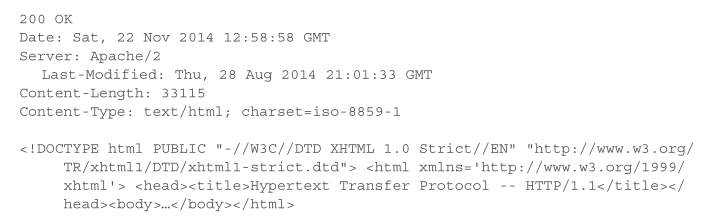
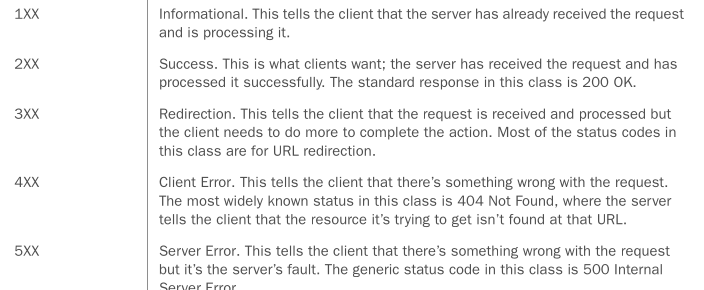
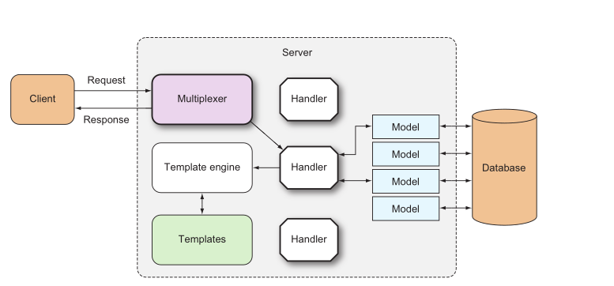

# go_webprogramming
web development with golang

### A web application looks like:

### HTTP request looks like:

### HTTP response looks like:

### Base of status code:

### A tipical go web application structure:

